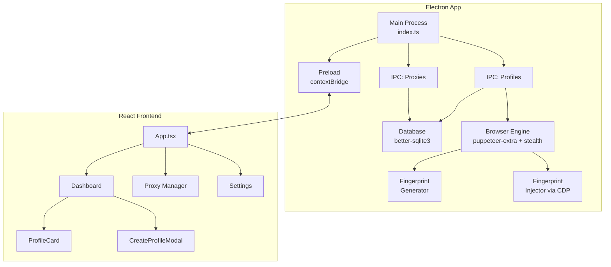

# MultiAccount Manager — Phase 1 MVP Walkthrough

## Summary

Built the complete Phase 1 MVP foundation for the **MultiAccount Manager** desktop app — a premium tool for managing multiple social media accounts with full fingerprint isolation.

## Architecture Diagram



## What Was Built

### Backend (Electron Main Process)

| Component | File | Key Features |
|-----------|------|--------------|
| **Database** | [connection.ts](file:///d:/Booster/src/main/database/connection.ts) | SQLite with WAL mode, auto-init schema |
| **Schema** | [schema.ts](file:///d:/Booster/src/main/database/schema.ts) | `profiles`, `proxies`, `sessions` tables |
| **Profiles CRUD** | [profiles.ts](file:///d:/Booster/src/main/database/profiles.ts) | Create/read/update/delete with isolated dirs |
| **Proxies CRUD** | [proxies.ts](file:///d:/Booster/src/main/database/proxies.ts) | AES encrypted passwords, connectivity test |
| **Fingerprint Generator** | [generator.ts](file:///d:/Booster/src/main/browser/fingerprint/generator.ts) | Deterministic seed-based, 10+ parameters |
| **Fingerprint Injector** | [injector.ts](file:///d:/Booster/src/main/browser/fingerprint/injector.ts) | CDP overrides: Canvas, WebGL, Audio, WebRTC |
| **Browser Engine** | [engine.ts](file:///d:/Booster/src/main/browser/engine.ts) | Puppeteer + stealth, proxy auth, lifecycle mgmt |
| **IPC Handlers** | [profiles.ts](file:///d:/Booster/src/main/ipc/profiles.ts), [proxies.ts](file:///d:/Booster/src/main/ipc/proxies.ts) | Secure Electron IPC bridge |
| **Main Process** | [index.ts](file:///d:/Booster/src/main/index.ts) | Frameless window, dark titlebar overlay |

### Frontend (React)

| Component | File | Description |
|-----------|------|-------------|
| **App Shell** | [App.tsx](file:///d:/Booster/src/renderer/App.tsx) | Sidebar navigation with gradient branding |
| **Dashboard** | [Dashboard.tsx](file:///d:/Booster/src/renderer/pages/Dashboard.tsx) | Profile grid, auto-polling, loading states |
| **Proxy Manager** | [ProxyManager.tsx](file:///d:/Booster/src/renderer/pages/ProxyManager.tsx) | Table, add form, test connectivity |
| **Settings** | [Settings.tsx](file:///d:/Booster/src/renderer/pages/Settings.tsx) | Engine status, disclaimer |
| **Profile Card** | [ProfileCard.tsx](file:///d:/Booster/src/renderer/components/ProfileCard.tsx) | Status indicator, launch/stop/delete |
| **Dark Theme CSS** | [global.css](file:///d:/Booster/src/renderer/styles/global.css) | Glassmorphism, gradients, animations |

## DeepSeek Recommendations Addressed

| # | Recommendation | Status |
|---|----------------|--------|
| 1 | Encrypt proxy passwords | ✅ AES encryption via `crypto-js` |
| 2 | Proxy with authentication | ✅ `page.authenticate()` on every page |
| 3 | electron-rebuild for native modules | ✅ `postinstall` script |
| 4 | Chromium binary management | ✅ Auto-detect system Chrome |
| 5 | Logging | ✅ `electron-log` integrated |
| 6 | Loading indicators | ✅ Spinner + overlay states |

## Build Verification

| Check | Result |
|-------|--------|
| **Vite renderer build** | ✅ 35 modules, 210KB (64KB gzipped) |
| **TypeScript main process** | ✅ 12 JS files compiled, exit code 0 |
| **Dependencies** | ✅ 376 packages, 0 critical vulnerabilities |

## How to Run

```bash
# Development mode (hot-reload):
npm run dev

# Production build:
npm run build
npm start
```

> [!NOTE]
> **Google Chrome must be installed** on the system for the browser engine to work. The app auto-detects Chrome's location on Windows, macOS, and Linux.

## Next Steps (Phase 2)
- Canvas & WebGL advanced spoofing tests
- Firebase authentication integration
- Premium licensing system
- Profile cloud sync
- Packaging with electron-builder
