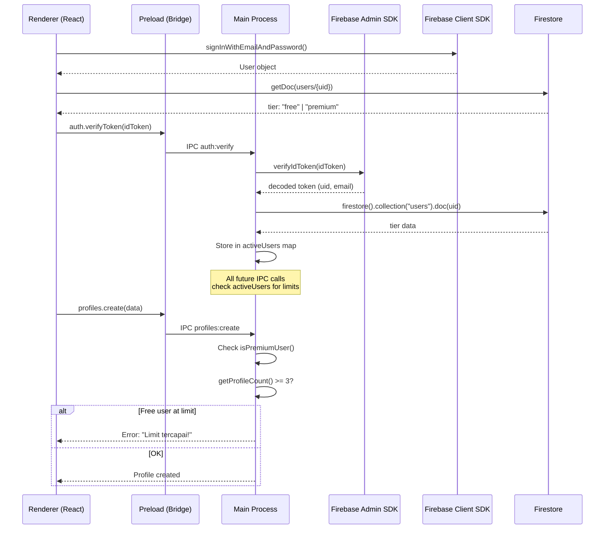

# MultiAccount Manager — Phase 2 Walkthrough

## Summary

Implemented **Firebase Authentication**, **Freemium Licensing** with server-side enforcement, and **Windows NSIS Packaging** for the MultiAccount Manager desktop app.

## Architecture Flow



## What Was Built

### New Files (Phase 2)

| File | Purpose |
|------|---------|
| [firebase.ts](file:///d:/Booster/src/renderer/firebase.ts) | Firebase Client SDK init (env vars) |
| [AuthContext.tsx](file:///d:/Booster/src/renderer/context/AuthContext.tsx) | Auth state, login/register/logout, tier sync |
| [Auth.tsx](file:///d:/Booster/src/renderer/pages/Auth.tsx) | Login/Register page with validation |
| [firebase-admin.ts](file:///d:/Booster/src/main/firebase-admin.ts) | Admin SDK init, token verification |
| [auth.ts](file:///d:/Booster/src/main/ipc/auth.ts) | Auth IPC handlers, activeUser store |
| [.env](file:///d:/Booster/.env) | Firebase config template |
| [.gitignore](file:///d:/Booster/.gitignore) | Credential protection |
| [vite-env.d.ts](file:///d:/Booster/src/renderer/vite-env.d.ts) | Vite type definitions |

### Modified Files

| File | Changes |
|------|---------|
| [App.tsx](file:///d:/Booster/src/renderer/App.tsx) | AuthProvider wrap, route protection, user/tier sidebar |
| [preload.ts](file:///d:/Booster/src/main/preload.ts) | Added auth IPC bridge methods |
| [types.ts](file:///d:/Booster/src/shared/types.ts) | Added auth API types to ElectronAPI |
| [index.ts](file:///d:/Booster/src/main/index.ts) | Firebase Admin init + auth handler registration |
| [profiles.ts](file:///d:/Booster/src/main/ipc/profiles.ts) | Server-side profile limit (Free=3) |
| [Dashboard.tsx](file:///d:/Booster/src/renderer/pages/Dashboard.tsx) | Limit/tier display, error messages |
| [global.css](file:///d:/Booster/src/renderer/styles/global.css) | Auth page + sidebar user styles |
| [package.json](file:///d:/Booster/package.json) | electron-builder config, package script |

## Security Model (DeepSeek Approved)

> [!IMPORTANT]
> Profile limits are enforced **server-side** in the Main Process. The renderer **cannot** spoof premium status.

- Renderer only sends Firebase ID Token (not [isPremium](file:///d:/Booster/src/main/ipc/auth.ts#23-26) flag)
- Main Process verifies token via Firebase Admin SDK
- Tier is fetched from Firestore by Main Process independently
- `activeUsers` map is internal to Main Process — unreachable from renderer
- Dev/offline fallback defaults to `free` tier

## Build Verification

| Check | Result |
|-------|--------|
| TypeScript main process | ✅ Exit code 0 |
| Vite renderer build | ✅ 54 modules transformed |
| electron-builder config | ✅ NSIS target configured |

## How to Use

```bash
# Development
npm run dev

# Build for production
npm run build

# Package Windows installer
npm run package
```

> [!NOTE]
> Before running, create a Firebase project and fill in [.env](file:///d:/Booster/.env) with your Firebase config + place `firebase-service-account.json` in the project root.
